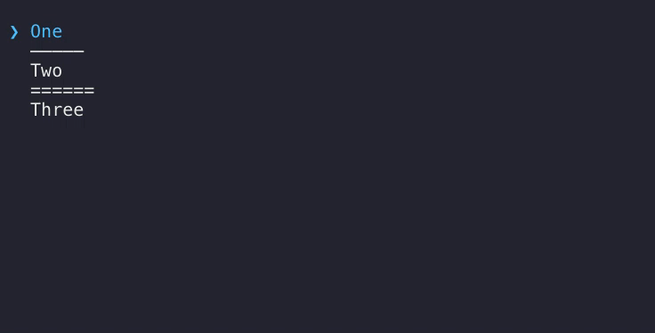

# ink-select [](https://travis-ci.org/karaggeorge/ink-select) [](https://github.com/sindresorhus/xo)

> Select Component for [Ink](https://github.com/vadimdemedes/ink)

Demo
---



Install
---

```
$ npm install ink-select
```

Usage
---

```js
const {h, Component, render, Text} = require('ink');
const {Select, Option, Separator} = require('../lib');

class Example extends Component {
  render() {
    return (
      <div>
        <Select onSelect={item => this.setState({message: item + ' was selected'})}>
          <Option value='1'>One</Option>

          <Separator />

          <Option value='2' onSelect={() => this.setState({message: 'Action for Two'})}>Two</Option>

          <Separator label='======' />

          <Option value='3'>Three</Option>
        </Select>
        <br />
        { this.state && this.state.message && <Text green>{this.state.message}</Text>}
      </div>
    );
  }
}

const unmount = render(<Example />);
```

Or, if you want to pass options as an array to get the same result:
```js
const {h, Component, render, Text} = require('ink');
const {Select, Option, Separator} = require('../lib');

class Example extends Component {
  render() {
    const options = [
      { label: 'One', value: 1 },
      { },
      { label: 'Two', value: 2, onSelect: () => this.setState({message: 'Action for Two'})},
      { label: '======' },
      { label: 'Three', value: 3 }
    ];

    return (
      <div>
        <Select options={options} onSelect={item => this.setState({message: item + ' was selected'})}/>
        <br />
        { this.state && this.state.message && <Text green>{this.state.message}</Text>}
      </div>
    );
  }
}

const unmount = render(<Example />);
```

Where any item that has no `value` key will be a separator. If `label` is passed it will be used, otherwise it will use the default.

## Props

### Select

#### cursorCharacter

Type: `string`
Default: `❯`

This character is used for the cursor.

#### onChange(value)

Type: `Function`

Function to call when the cursor is moved up or down.

#### onSelect(value)

Type: `Function`

Function to call when an item is selected by pressing Enter/Space

### Option

#### value

Type: `any`
**Required**

Is passed to `onChange` and `onSelect` when this item is selected

### Separator

#### label

Type: `string`
Default: `—————`

Text to be used as the separator

Key bindings
---

| key              | action               |
|------------------|----------------------|
| <kbd>Space</kbd> | select option        |
| <kbd>Enter</kbd> | select option        |
| <kbd>↑</kbd>     | move the cursor up   |
| <kbd>↓</kbd>     | move the cursor down |

Related
---
- [ink-select-input](https://github.com/vadimdemedes/ink-select-input) - Alternative Select input component
- [ink-scrollbar](https://github.com/karaggeorge/ink-scrollbar) - Scrollbar component

LICENSE
---

MIT © 2018 [George Karagkiaouris](https://github.com/karaggeorge)
